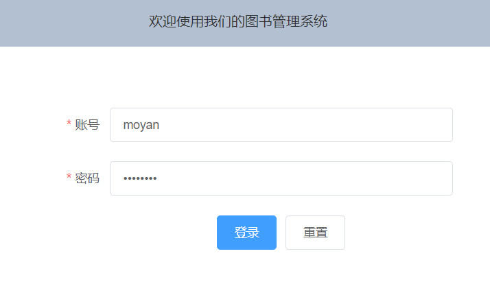
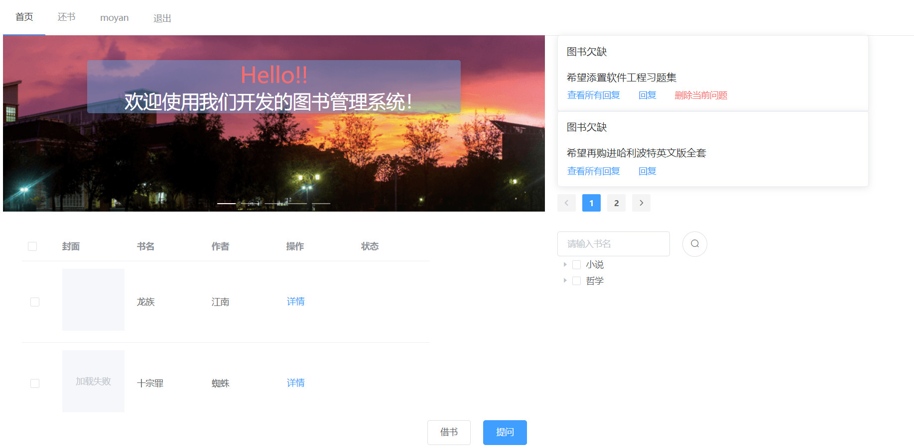
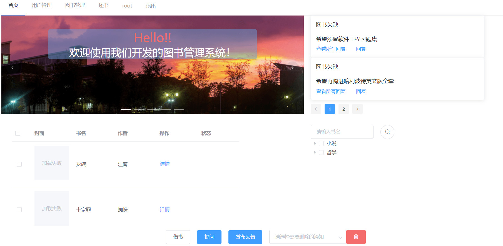
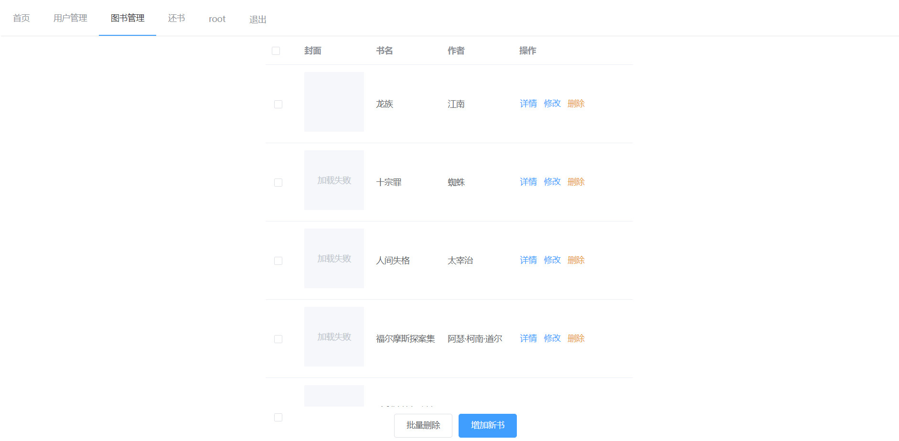
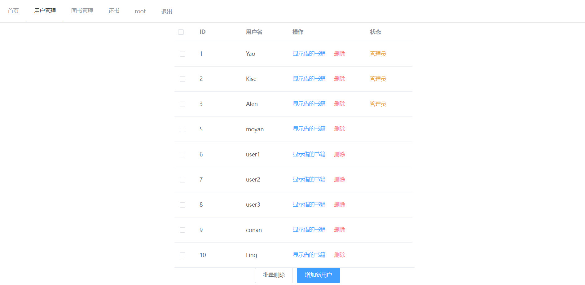

## 基于SpringBoot和Vue的图书管理系统

后端框架：SpringBoot，MyBatis_plus，Shrio-Redis；

前端框架：Vue；UI：Element。

[视频演示](https://www.bilibili.com/video/BV13o4y1y7Jj)

## 数据库

1. 启动MySQL：

```shell
mysqld --console
```

2. 初始化数据表单：

将`mysql_init.sql`放在MySQL里面运行，MySQL的账号和密码均默认为`root`，可以在后端的`application.yml`中自定义修改。

```sql
source mysql_init.sql;
```

---

## 后端

- jdk1.8
- main function：`TestapiApplication.java`
- 端口：8081

## 前端

- npm 16.1.0
- 端口：8080

```shell
npm install
npm run serve
```

## 界面效果

注：虽然效果很丑，但是功能还是挺全的。

#### 用户登录页面：

根据登录用户等级的不同，首页会出现不同的效果。



#### 用户首页：

1. 现有的全部**图书**，被借走的图书会有特殊标记，通过**详情**按钮可以看到更多关于当前图书的信息；
2. 通过还书界面可以退还已经借走的书；
3. 管理员发布的**公告**；
4. 其他人或管理员发布的**评论**以及**回复**。
5. **搜索框**。



#### 管理员首页

- 用户管理
- 图书管理
- 增加公告



##### 图书管理页面



##### 用户管理页面




参考：[vueblog](https://github.com/MarkerHub/vueblog)